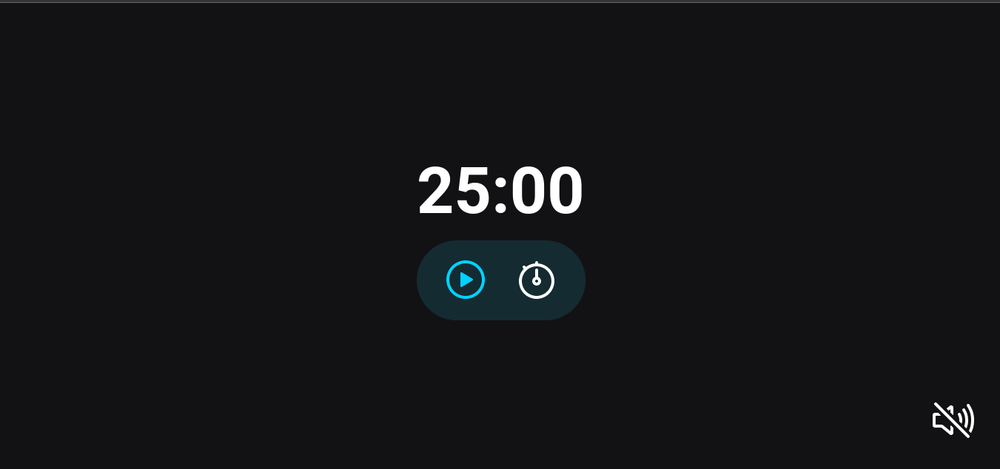

  

## 🚀 Tecnologias

Esse projeto foi desenvolvido com as seguintes tecnologias:

## 💻 Projeto

O projeto Focus Timer é uma aplicação que disponibiliza um timer simples com som de fundo, ele foi elaborado nas aulas do stage 05 no programa Explorer da Rocketseat.

